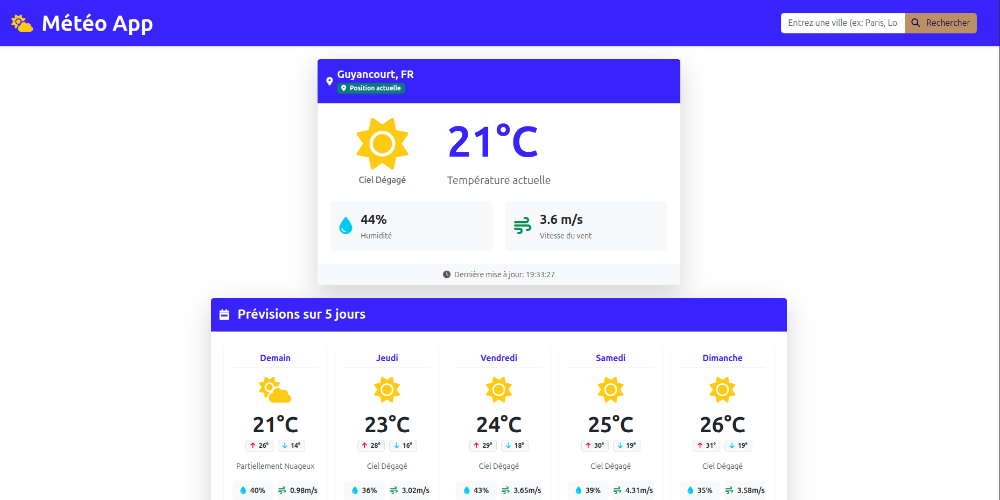

# 🌦️ Application Météo Angular


Une application météo moderne et réactive développée avec Angular 20, permettant de consulter la météo actuelle et les prévisions sur 5 jours pour n'importe quelle ville dans le monde.

URL du site : [https://angular-meteo-app-xi.vercel.app/](https://meteo.nedellec-julien.fr/)



## ✨ Fonctionnalités

- 🔍 **Recherche par ville** - Trouvez la météo pour n'importe quelle ville dans le monde
- 📍 **Géolocalisation** - Obtenez automatiquement la météo de votre position actuelle
- 🌡️ **Météo actuelle** - Température, description, humidité, vitesse du vent
- 📅 **Prévisions sur 5 jours** - Consultez les prévisions pour les 5 prochains jours
- 📱 **Design responsive** - Interface adaptée à tous les appareils
- 🇫🇷 **Interface en français** - Application entièrement en français
- 🔄 **Indicateurs de chargement** - Feedback visuel pendant le chargement des données
- ⚠️ **Gestion des erreurs** - Messages d'erreur clairs en cas de problème

## 🛠️ Technologies utilisées

- **Angular 20.0.0** - Framework front-end moderne
- **TypeScript 5.8** - Typage statique pour JavaScript
- **Bootstrap 5.3** - Framework CSS pour un design responsive
- **Font Awesome 6.4** - Icônes pour l'interface utilisateur
- **OpenWeatherMap API** - API météo pour les données en temps réel
- **RxJS** - Programmation réactive pour gérer les flux de données
- **API Geolocation du navigateur** - Pour obtenir la position de l'utilisateur

## 📋 Prérequis

- Node.js (version 18 ou supérieure)
- npm (version 9 ou supérieure)
- Clé API OpenWeatherMap (gratuite)

## 🚀 Installation

1. Clonez ce dépôt :

   ```bash
   git clone https://github.com/votre-utilisateur/angular-meteo-app.git
   cd angular-meteo-app
   ```

2. Installez les dépendances :

   ```bash
   npm install
   ```

3. Configurez votre clé API OpenWeatherMap :

   - Créez un fichier `src/environments/environment.development.ts` avec le contenu suivant :

   ```typescript
   export const environment = {
     apiUrl: "/api",
     API_KEY: "VOTRE_CLE_API_OPENWEATHERMAP",
   };
   ```

4. Lancez l'application en mode développement :

   ```bash
   npm start
   ```

5. Ouvrez votre navigateur à l'adresse `http://localhost:4200`

## 🔧 Commandes disponibles

- **Démarrer le serveur de développement** : `npm start`
- **Compiler l'application** : `npm run build`
- **Exécuter les tests unitaires** : `npm test`
- **Linter le code** : `npm run lint`

## 📱 Utilisation

1. **Recherche par ville** :

   - Saisissez le nom d'une ville dans la barre de recherche
   - Appuyez sur Entrée ou cliquez sur l'icône de recherche

2. **Utiliser la géolocalisation** :

   - Cliquez sur le bouton de géolocalisation pour obtenir la météo de votre position actuelle
   - Autorisez l'accès à votre position si le navigateur le demande

3. **Consulter les prévisions** :
   - Après avoir recherché une ville, faites défiler vers le bas pour voir les prévisions sur 5 jours

## 🌐 API OpenWeatherMap

Cette application utilise l'API OpenWeatherMap pour récupérer les données météorologiques. Pour utiliser l'application, vous devez :

1. Créer un compte sur [OpenWeatherMap](https://openweathermap.org/api)
2. Obtenir une clé API gratuite
3. Configurer cette clé dans le fichier d'environnement comme indiqué dans la section Installation

## 🤝 Contribution

Les contributions sont les bienvenues ! N'hésitez pas à ouvrir une issue ou à soumettre une pull request.

1. Forkez le projet
2. Créez votre branche de fonctionnalité (`git checkout -b feature/amazing-feature`)
3. Committez vos changements (`git commit -m 'Add some amazing feature'`)
4. Poussez vers la branche (`git push origin feature/amazing-feature`)
5. Ouvrez une Pull Request

## 📄 Licence

Ce projet est sous licence MIT. Voir le fichier `LICENSE` pour plus d'informations.

---

Développé avec ❤️ par [Votre Nom]
# angular-meteo-app
